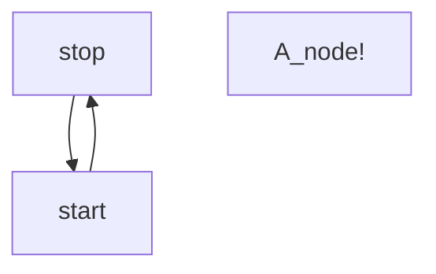
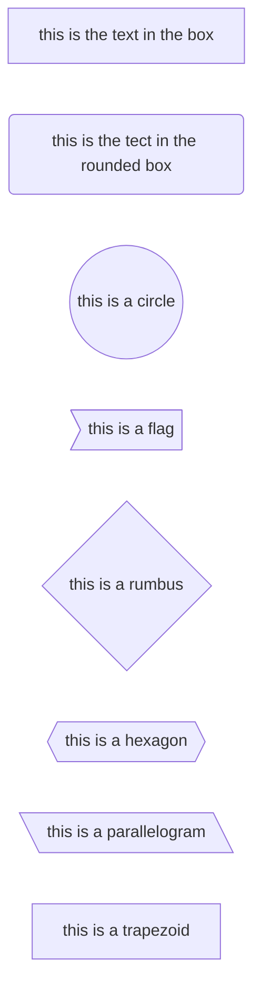
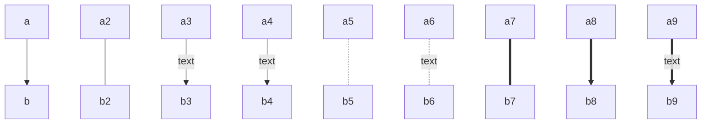
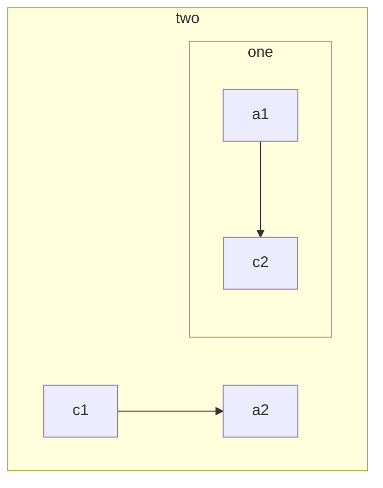
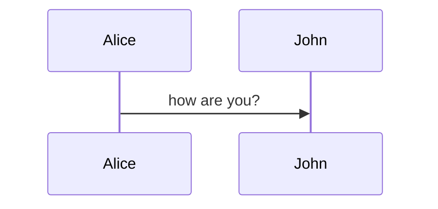
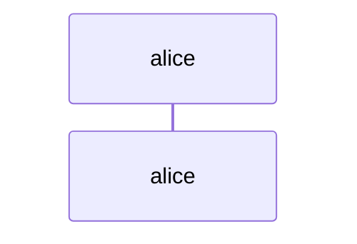

	#Note-mermaid

# Mermaid —————————————————
## Graph  Diagram ---

### Simple Start 👾——————————————



### Nodes and Shapes ———————————–



### Links between nodes



### Subgraph



## Sequence Diagram

### Simple Start



### Participants



### Lines and Arrows

| # **Type** | # **Description**                      |
| ---------- | -------------------------------------- |
| =>         | solid line without Arrow               |
| –>         | Dotted line without arrow              |
| –>>        | Solid line with a  arrow head          |
| -x         | Solid line with a cross at the the end |
| –X         | Dotted line with a cross at the end    |


## Class Diagram
### Simple start
```mermaid
classDiagram
	class Animal
	Animal: int age
	Animal: int type
	Animal: isMammal()